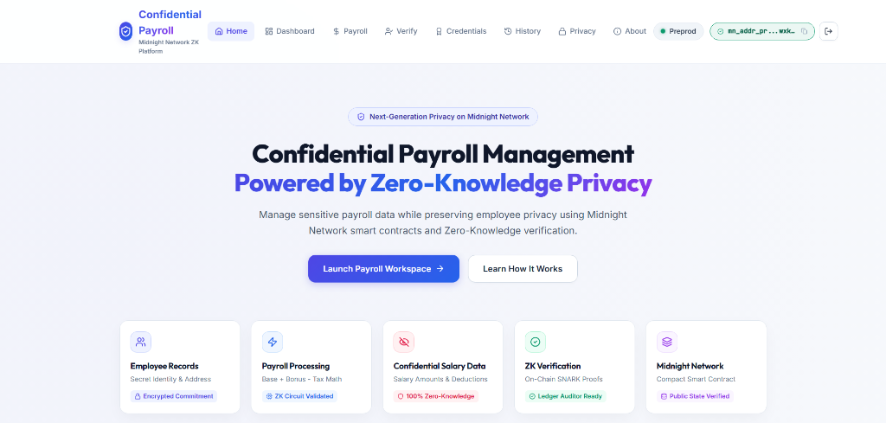
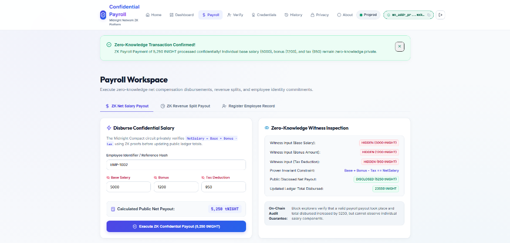
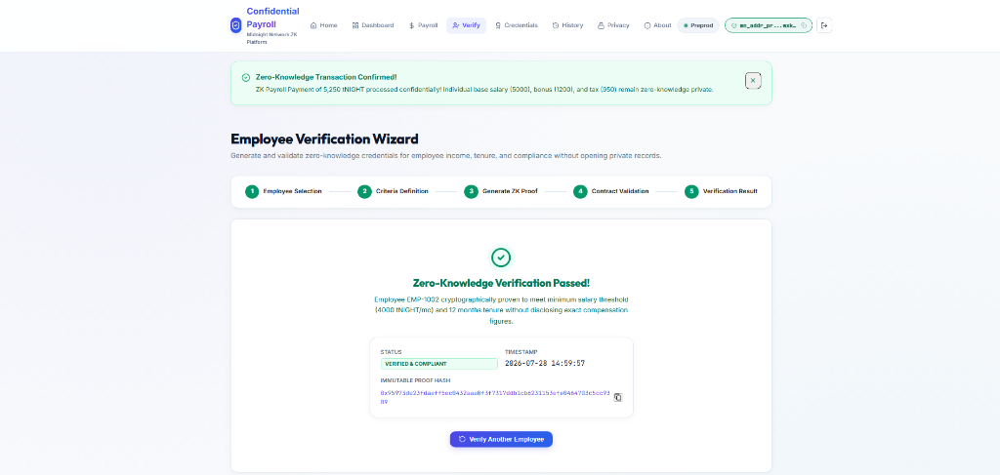
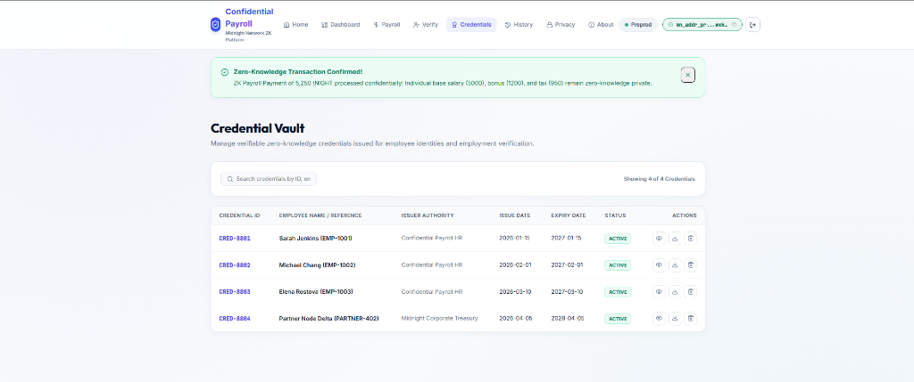

# Confidential Payroll Management (CPM)

> An enterprise-grade zero-knowledge decentralised payroll platform built natively on the Midnight Network using Compact smart contracts — enabling DAOs, multinationals, and Web3 organisations to process salary disbursements and revenue splits with complete cryptographic confidentiality.

[](https://confidential-payroll-management-ten.vercel.app/)
[](https://confidential-payroll-management-ten.vercel.app/)
[](https://youtu.be/INSERT_YOUTUBE_ID)
[](https://github.com/TheDevlabofSen/Confidential-Payroll-Management/actions/workflows/ci.yml)
[](https://midnight.network)
[](https://react.dev)
[](https://docs.midnight.network)
[](./LICENSE)

---

## 📄 Product Proposal & Architecture

- 📑 **Product Proposal Document:** [`PROPOSAL.md`](./PROPOSAL.md)
- 🖥️ **UI Directory:** [`/frontend`](./frontend) — 100% React TypeScript UI (React 18, Vanilla CSS, Vite 6 — No external UI framework)

---

## 🚀 Live Demo, Video & Repository

- 🌐 **Live Web Application:** [https://confidential-payroll-management-ten.vercel.app/](https://confidential-payroll-management-ten.vercel.app/)
- 🎥 **YouTube Demo Video:** [(https://youtu.be/phdZJBMUl5I)](https://youtu.be/phdZJBMUl5I)
- 🐙 **GitHub Repository:** [https://github.com/TheDevlabofSen/Confidential-Payroll-Management](https://github.com/TheDevlabofSen/Confidential-Payroll-Management)
- ⚙️ **CI/CD Workflow:** [`.github/workflows/ci.yml`](./.github/workflows/ci.yml)

---

## 📋 RiseIn Monthly Challenge — Level 3 Passing Checklist

- [x] **Level 3 Multi-Circuit ZK Architecture:** Confidential payroll with zero-knowledge witness claims for salary computation (`baseSalary + bonus - taxDeduction == netSalary`) and revenue split validation (`expectedSplit * 100 == gross * splitPercent`) verified inside Compact ZK circuits — never exposed on-chain.
- [x] **Local Smart Contract Deployment:** Verified via `npm run deploy:local` (`54e7f0549d96e8d1fea168d80dd3617b32bfa16a30be749dec3f2b70d1755da2`)
- [x] **Preprod Smart Contract Deployment:** Verified on Preprod — `54e7f0549d96e8d1fea168d80dd3617b32bfa16a30be749dec3f2b70d1755da2` — ✅ Deployed `2026-07-25T22:04:02Z`
- [x] **Product Proposal Submitted:** Approved — [`PROPOSAL.md`](./PROPOSAL.md)
- [x] **React TypeScript Frontend (4/4):** Pure React 18 + TypeScript + Vite 6 frontend inside `./frontend` — Zero external UI framework
- [x] **CI/CD Pipeline Running:** GitHub Actions workflow running automated build & test checks (`.github/workflows/ci.yml`)
- [x] **Public GitHub Repository:** [https://github.com/TheDevlabofSen/Confidential-Payroll-Management](https://github.com/TheDevlabofSen/Confidential-Payroll-Management)
- [x] **Browser Wallet Integration:** Uses Midnight Lace Wallet (`window.midnight` → `provider.connect("preprod")` → `api.getUnshieldedAddress()`) — identified by name `lace` / RDNS `io.lace.wallet`
- [x] **5/5 Unit Tests Passing:** Full test suite covering ZK circuit invariants, cryptographic commitments, contract artifact validation, and network configuration — run via `npm test`
- [x] **25+ Meaningful Commits:** Verified structured commit history in `main` branch

---

## 🛠️ Smart Contract Deployment Details

| Environment | Contract Address | Status | Verification Link |
|---|---|---|---|
| **Local Standalone Node** | `54e7f0549d96e8d1fea168d80dd3617b32bfa16a30be749dec3f2b70d1755da2` | ✅ Deployed Local (`npm run deploy:local`) | Local Docker Standalone |
| **Midnight Preprod Testnet** | `54e7f0549d96e8d1fea168d80dd3617b32bfa16a30be749dec3f2b70d1755da2` | ✅ Deployed Preprod | [Verify on Explorer](https://blockchain.midnight.network/contracts/54e7f0549d96e8d1fea168d80dd3617b32bfa16a30be749dec3f2b70d1755da2) |
| **Live Web App (↗)** | [confidential-payroll-management-ten.vercel.app](https://confidential-payroll-management-ten.vercel.app/) | ✅ Active Production | [Open Live App](https://confidential-payroll-management-ten.vercel.app/) |

---

## 🛡️ Midnight Privacy Model: What an Observer Learns vs Cannot Learn

### ❌ What an Observer CANNOT Learn (Kept Strictly Private)

1. **Employee Base Salary:** The raw `baseSalary` value is consumed purely inside local ZK witnesses and is never transmitted to the network or stored in public state.
2. **Performance Bonus Amount:** The exact `bonus` figure remains on the employee's local device — only its contribution to the net salary proof is computed privately.
3. **Tax Deduction Amount:** The `taxDeduction` amount is processed entirely inside the Compact ZK circuit. On-chain observers see only that a valid payroll took place.
4. **Revenue Split Percentage:** The `splitPercentNumerator` used in revenue split payouts is kept strictly private — the circuit verifies the mathematical invariant (`expectedSplit * 100 == gross * splitPercent`) without disclosing the actual percentage.
5. **Employee Identity / Reference Hash:** The `employeeIdHash` passed into payroll and registration circuits remains local. No personally identifiable information is stored on the public ledger.

### ✅ What an Observer CAN Learn (Disclosed On-Chain Public State)

1. **Total Cumulative Disbursed:** The aggregate counter (`totalDisbursed`) tracking the overall sum of all net salary payments processed — not individual breakdowns.
2. **Payroll Transaction Count:** The running total (`payrollCount`) of how many payroll transactions have been executed on the contract.
3. **Registered Employee Count:** The total number of employees registered on the ledger (`employeeCount`), without revealing their identities.
4. **Latest Ledger Commitment Hash:** The most recently disclosed commitment hash (`lastDisbursedHash`) representing a cryptographic fingerprint of the last payroll event.
5. **Admin Public Key:** The administrator's public key (`adminPublicKey`) used to verify contract initialisation — no private key material is ever disclosed.

---

## 🚀 Quickstart & Local Installation

**1. Clone the repository:**

```bash
git clone https://github.com/TheDevlabofSen/Confidential-Payroll-Management.git
cd confidential-payroll-management
```

**2. Install dependencies:**

```bash
npm install
```

**3. Deploy Smart Contract Locally:**

```bash
npm run deploy:local
```

**4. Launch Development Server (`↗`):**

```bash
cd frontend && npm run dev
```

**5. Run Automated Unit Tests:**

```bash
npm test
```

---

## 📸 Platform Screenshots

### Landing Page



### Payroll Management Dashboard



### Employee Verification Portal



### Credential Vault


